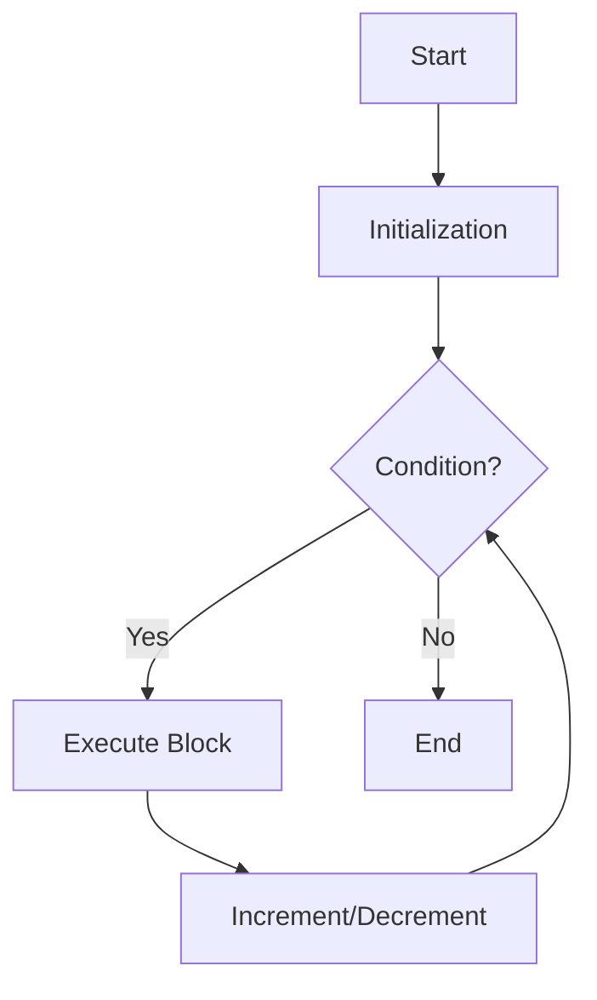
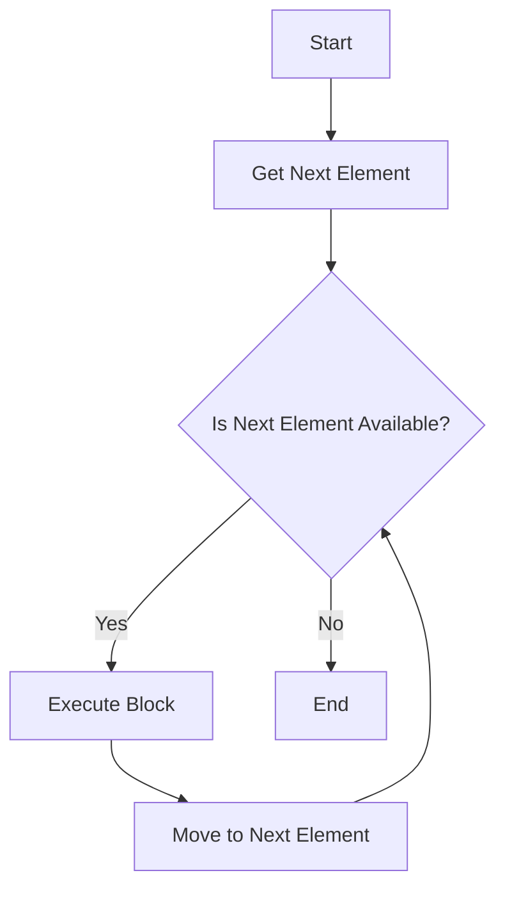
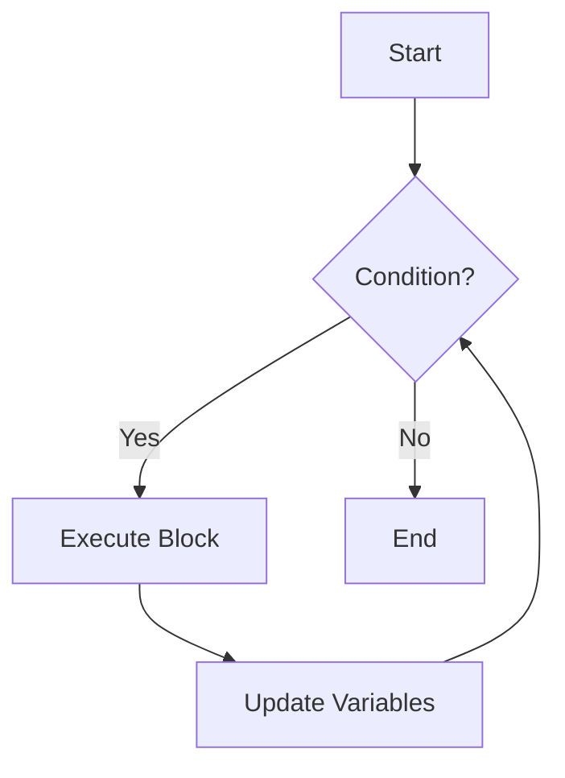
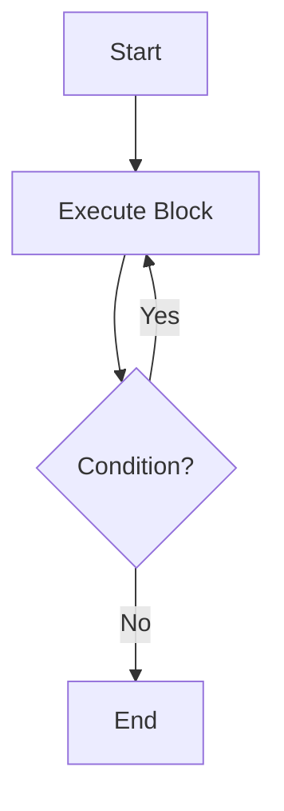
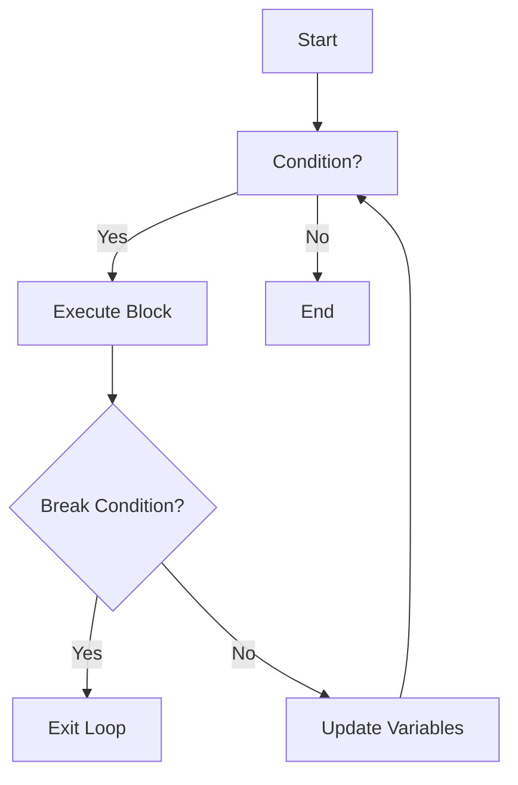
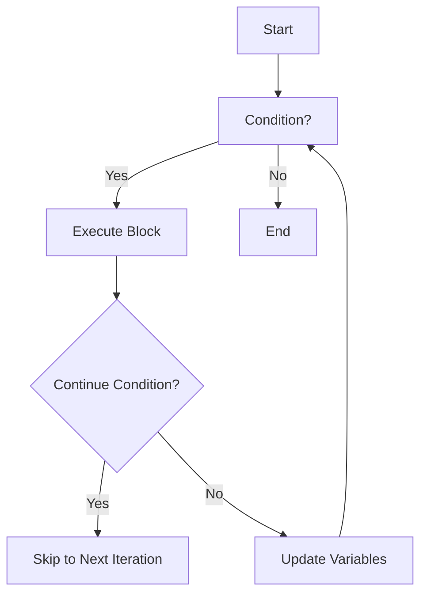
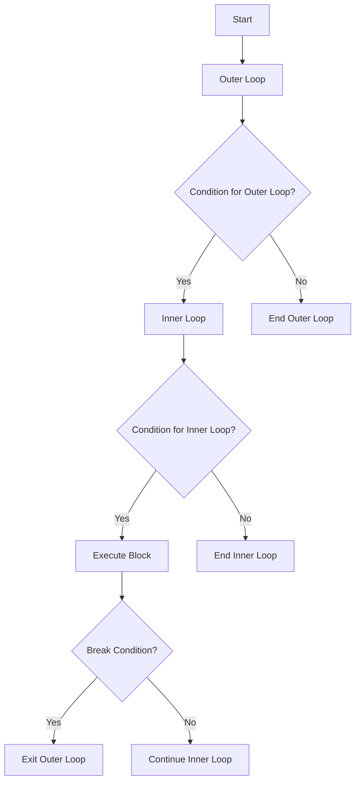
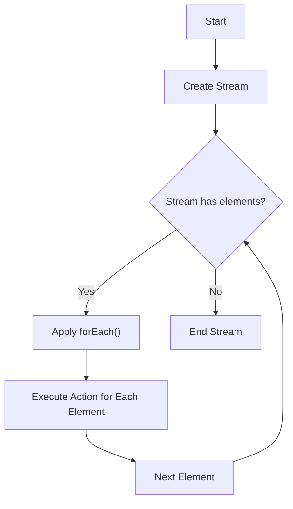

# 🚀 Java Looping Statements
---

## Table of Contents
1. Introduction to Loops
2. `for` Loop
3. Enhanced `for-each` Loop
4. `while` Loop
5. `do-while` Loop
6. Loop Control Statements
   - `break`
   - `continue`
   - Labeled loops
---

## Introduction to Loops
Loops in Java are used to execute a block of code repeatedly under a given condition.

---

## `for` Loop
The `for` loop is used when the number of iterations is known beforehand. It is typically used to iterate over a range of numbers, or through arrays or collections.



### Syntax:
```java
for(initialization; condition; update) {
    // Code to be executed
}
```
### Example:
```java
for(int i = 0; i < 5; i++) {
    System.out.println("i = " + i);
}
```

---

## Enhanced `for-each` Loop
Introduced in Java 5, useful for iterating over arrays and collections.
The enhanced for loop (also known as the for-each loop) is designed for iterating through arrays or collections. It eliminates the need to manage loop counters or indices, making it cleaner and more concise.



### Syntax:
```java
for(type var : array) {
    // Use var
}
```
### Example:
```java
int[] numbers = {1, 2, 3, 4, 5};
for(int num : numbers) {
    System.out.println(num);
}
```

---

## `while` Loop
The while loop is used when the number of iterations is not known and the loop should continue as long as a certain condition is true. The condition is checked before each iteration.



### Syntax:
```java
while(condition) {
    // Code to be executed
}
```
### Example:
```java
int i = 0;
while(i < 5) {
    System.out.println(i);
    i++;
}
```

---

## `do-while` Loop
The do-while loop is similar to the while loop, but the key difference is that the condition is checked after the loop body is executed. This ensures that the loop runs at least once even if the condition is initially false.



### Syntax:
```java
do {
    // Code to be executed
} while(condition);
```
### Example:
```java
int i = 0;
do {
    System.out.println(i);
    i++;
} while(i < 5);
```

---

## Loop Control Statements
### `break`
Terminates the loop prematurely.




```java
for(int i = 0; i < 10; i++) {
    if(i == 5) break;
    System.out.println(i);
}
```

### `continue`
Skips the current iteration.



```java
for(int i = 0; i < 10; i++) {
    if(i % 2 == 0) continue;
    System.out.println(i);
}
```

### Labeled loops
labeled loops are used to control the flow of nested loops. They allow you to break or continue the execution of specific loops when multiple loops are nested inside each other.



```java
outer:
for(int i = 0; i < 3; i++) {
    for(int j = 0; j < 3; j++) {
        if(i == j) continue outer;
        System.out.println("i=" + i + " j=" + j);
    }
}
```

---

## Streams and `forEach()`
Java 8 introduced the Stream API and lambda expressions.



### Example with Stream and `forEach()`:
```java
import java.util.*;
import java.util.stream.*;

public class Main {
    public static void main(String[] args) {
        List<String> names = Arrays.asList("Alice", "Bob", "Charlie");
        names.stream().forEach(name -> System.out.println(name));
    }
}
```


## Note :
| Loop Type       | Condition Check | Use Case                             |
|----------------|------------------|--------------------------------------|
| `for`          | Before loop      | Known iteration count                |
| `for-each`     | Implicit         | Arrays/Collections                   |
| `while`        | Before loop      | Unknown iteration count              |
| `do-while`     | After loop       | At least one execution guaranteed    |

---


