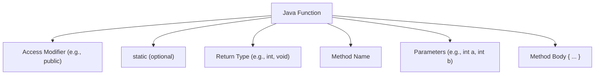

# 🧩 Java Functions and Methods 

---

## Table of Contents
1. [Introduction](#1-introduction)
2. [What is a Method?](#2-what-is-a-method)
3. [Defining a Method](#3-defining-a-method)
4. [Method Parameters](#4-method-parameters)
5. [Return Types](#5-return-types)
6. [Static vs Non-Static Methods](#6-static-vs-non-static-methods)
7. [Method Overloading](#7-method-overloading)
8. [Recursion](#8-recursion)


---

## 1. Introduction
In Java, **methods** (also known as functions in other languages) are blocks of code that perform a specific task. They help organize code, reduce redundancy, and enhance readability.

<b>Syntax</b>
```Java
accessModifier [static] returnType methodName(parameterList) {
    // method body
}
```




---

## 2. What is a Method?
A method is a group of statements that perform an operation. It is defined inside a class and can be called using an object or class name (if static).

---

## 3. Defining a Method
To define a method, follow this basic structure:
```java
accessModifier [static] returnType methodName(parameterList) {
    // code to be executed
}
```
### 📊 Components of a Method

| Component        | Example                | Description                                                       |
|------------------|------------------------|-------------------------------------------------------------------|
| 🔓 **Access Modifier** | `public`, `private`, `protected` | Controls method visibility to other classes. Defines who can access this method. |
| ⚙️ **static**        | `static` (optional)     | Indicates that the method belongs to the class itself, not to instances of the class. |
| 🎯 **Return Type**   | `int`, `void`, `String` | The type of value the method returns. Use `void` if the method doesn't return anything. |
| 🏷️ **Method Name**   | `add`, `printMessage`   | The name used to call the method. Follow **camelCase** naming convention. |
| 🎁 **Parameters**     | `(int a, int b)`        | The values passed to the method when it is called. A method can have no parameters. |
| 🧱 **Method Body**    | `{ return a + b; }`     | The code that runs when the method is called. It performs the task defined by the method. |


```java
public class Demo {
    public static void greet() {
        System.out.println("Hello, world!");
    }

    public static void main(String[] args) {
        greet(); // Method call
    }
}
```
**Output:**
```
Hello, world!
```

---

## 4. Method Parameters
In Java, method parameters are variables that you define inside a method signature to receive input values when the method is called. Each parameter must have a type (like int, String, or a custom class) and a name (an identifier used inside the method body). Parameters allow methods to work dynamically with different inputs.

### 📊 Parameter Types in Java

| Category           | Type Examples                 | Description                                                                 |
|--------------------|-------------------------------|-----------------------------------------------------------------------------|
| 🔢 Primitive Types  | `int`, `double`, `boolean`, `char` | Basic built-in types. Passed by value.                                      |
| 📦 Object Types     | `String`, `List`, `User`, etc. | Any class instance. Passed by reference (but still pass-by-value in Java).  |
| 🧱 Arrays           | `int[]`, `String[]`            | Used to pass multiple values of the same type.                             |
| 📚 Varargs          | `String... args`, `int... nums`| Allows passing a variable number of arguments as an array.                 |
| 🚫 No Parameters    | `none`                         | A method can also have no parameters: `void sayHello()`                    |

---

```java
public class MathOps {
    public static int add(int a, int b) {
        return a + b;
    }

    public static void main(String[] args) {
        System.out.println(add(5, 3));
    }
}
```
**Output:**
```
8
```

---

## 5. Return Types
Methods can return values or be `void` if they return nothing.
```java
public static String getMessage() {
    return "Java is fun!";
}
```

---

## 6. Static vs Non-Static Methods
- **Static** methods can be called without creating an object.
- **Non-static** methods require an object.

```java
public class Greet {
    public void sayHello() {
        System.out.println("Hello from object");
    }

    public static void main(String[] args) {
        Greet g = new Greet();
        g.sayHello();
    }
}
```
**Output:**
```
Hello from object
```

---

## 7. Method Overloading
### Definition:
Method Overloading means having multiple methods with the same name but different parameter lists within the same class. It increases the readability of the program.

### Example:
```java
public class OverloadDemo {
    public static void display(int a) {
        System.out.println("Integer: " + a);
    }

    public static void display(String a) {
        System.out.println("String: " + a);
    }

    public static void main(String[] args) {
        display(10);
        display("Java");
    }
}
```
**Output:**
```
Integer: 10
String: Java
```

---

## 8. Recursion
### Definition:
Recursion is the process in which a method calls itself directly or indirectly to solve a problem. A recursive method must have a base condition to stop the recursion.

### Example:
```java
public class RecursionDemo {
    public static int factorial(int n) {
        if (n == 1) return 1;
        return n * factorial(n - 1);
    }

    public static void main(String[] args) {
        System.out.println(factorial(5));
    }
}
```
**Output:**
```
120
```

---


### Lambda Expressions (Java 8+)

#### Definition:
A **lambda expression** is a concise way to represent an anonymous function (a function without a name) that can be passed around as an object. It is used primarily to define inline implementations of functional interfaces.

Syntax:
```java
(parameters) -> { body }
```

### Example:
```java
interface Greeting {
    void sayHello();
}

public class LambdaDemo {
    public static void main(String[] args) {
        Greeting g = () -> System.out.println("Hello using lambda!");
        g.sayHello();
    }
}
```
**Output:**
```
Hello using lambda!
```

### Method References
#### Definition:
Method reference is a shorthand notation of a lambda expression to call a method. It uses the `::` operator and can be used to refer to a static method, an instance method, or a constructor.

Syntax:
```
ClassName::methodName
object::instanceMethod
ClassName::new // constructor reference
```

### Example:
```java
import java.util.Arrays;

public class MethodRefDemo {
    public static void print(String s) {
        System.out.println(s);
    }

    public static void main(String[] args) {
        String[] names = {"Alice", "Bob", "Charlie"};
        Arrays.stream(names).forEach(MethodRefDemo::print);
    }
}
```
**Output:**
```
Alice
Bob
Charlie
```

